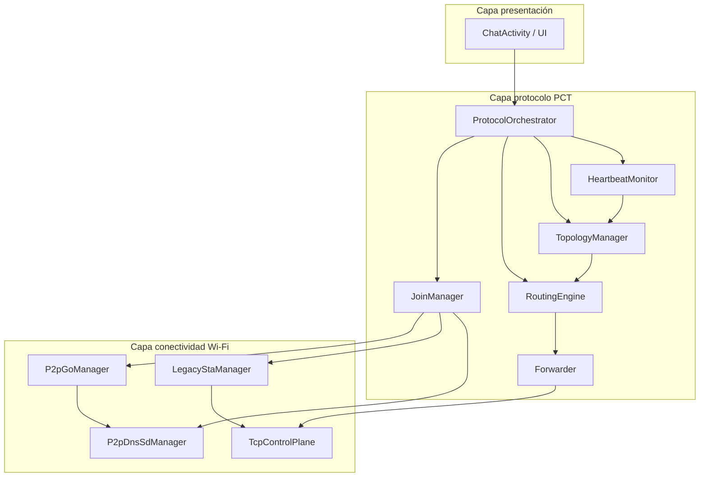

# 03 — Arquitectura del sistema

**Versión:** 0.1.0-pre

---

## 1. Vista de componentes



---

## 2. Responsabilidades por módulo

| Módulo | Responsable | Función |
|---|---|---|
| `P2pGoManager` | Brandon | `createGroup()`, `requestGroupInfo()`, SSID/PSK |
| `P2pDnsSdManager` | Brandon | `addLocalService`, `discoverServices`, listeners |
| `LegacyStaManager` | Brandon | `WifiNetworkSpecifier`, asociación upstream |
| `TcpControlPlane` | Brandon | Accept/connect, framing, I/O |
| `RoutingEngine` | Juan Carlos | Fusión tablas, next-hop, anti-ciclos |
| `TopologyManager` | Juan Carlos | `epoch`, roles, `parent_nid`, eventos |
| `JoinManager` | Ambos | `_pct-seek` / `JOIN_*` |
| `HeartbeatMonitor` | Juan Carlos | PING/PONG, detección caídas |
| `Forwarder` | Juan Carlos | Reenvío `DATA`/`FORWARD` |
| `ProtocolOrchestrator` | Ambos | Máquina de estados global |

---

## 3. Hilos / concurrencia (teórico)

| Hilo / corrutina | Prioridad | Tareas |
|---|---|---|
| `Main/UI` | Normal | Interfaz, cola mensajes usuario |
| `WifiCallback` | Main looper P2P | Callbacks `WifiP2pManager` |
| `TcpAccept` | IO | `ServerSocket.accept()` en `ctrl_port` |
| `TcpPeer-N` | IO | Un hilo/corrutina por vecino directo |
| `Timer` | Background | PING, expiración rutas STALE |
| `DnsSd` | Main looper P2P | Registro y descubrimiento servicios |

**Regla:** mutación de tablas de rutas solo desde un actor (`RoutingEngine` con mutex).

---

## 4. Planos del protocolo

| Plano | Transporte | Contenido |
|---|---|---|
| Descubrimiento | DNS-SD P2P | `_pct-seek`, `_pct-ctrl` TXT |
| Control | TCP | HELLO, JOIN_*, TOPO_UPDATE, PING/PONG, NODE_DOWN |
| Datos | TCP | DATA, FORWARD |

---

## 5. Identificadores lógicos

| Campo | Tamaño | Alcance |
|---|---|---|
| `node_id` | 16 B | Vida del dispositivo en la app |
| `epoch` | 4 B | Versión topológica de la red |
| `tree_version` | 4 B | Incremento en cada JOIN/CUT |
| `session_epoch` | 4 B | Par conversacional (src,dst) |
| `offer_id` | 4 B | Idempotencia JOIN |

---

## 6. Diagrama de despliegue (3 nodos)

```
   [ GO-A / ROOT ]  ←── legacy STA ──  [ GO-B / BRIDGE ]  ←── legacy STA ──  [ GO-C / LEAF ]
        │                                      │                                      │
   _pct-ctrl                              _pct-ctrl                              _pct-ctrl
   TCP :8765                              TCP :8765                              TCP :8765
        └──────────── reenvío TCP en B (Forwarder) ──────────────────────────────────┘
```

---

## 7. Entregables UML (Incremento 1)

- [ ] Diagrama de clases: módulos §2
- [ ] Diagrama de secuencia: unión 2 GO (ver `11-validation-matrix.md` EXP-01)
- [ ] Diagrama de secuencia: cadena 3 nodos (EXP-03)
- [ ] Diagrama de estados: ver `08-state-machines.md`
