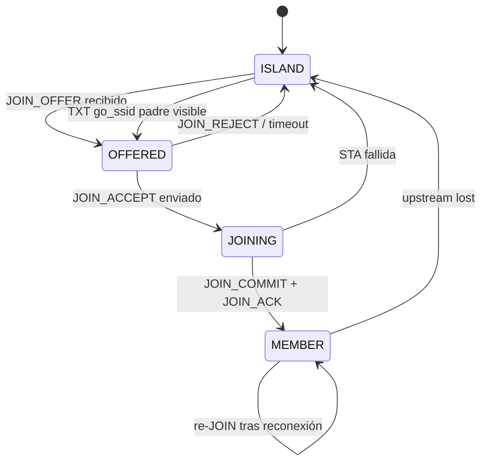
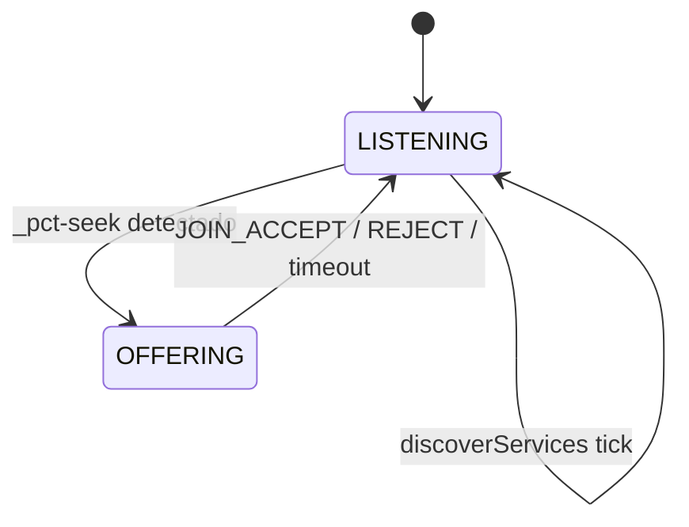

# 08 — Máquinas de estado

**Versión:** 0.1.0-pre

---

## 1. Estados radio (`RadioState`)

| Estado | GO propio | STA legacy upstream | DNS-SD activo |
|---|---|---|---|
| `R_BOOT` | — | — | — |
| `R_GO_READY` | Sí | No | `_pct-seek` o `_pct-ctrl` |
| `R_GO_UPSTREAM` | Sí | Sí (padre) | `_pct-ctrl` |
| `R_ISLAND_SEEK` | Sí | No | `_pct-seek` |

**Transiciones radio:**

```
R_BOOT
  │ createGroup() OK
  ▼
R_GO_READY
  │ requestNetwork(padre) OK
  ▼
R_GO_UPSTREAM

R_GO_UPSTREAM
  │ upstream lost
  ▼
R_ISLAND_SEEK
  │ JOIN_COMMIT OK
  ▼
R_GO_UPSTREAM
```

---

## 2. Estados lógicos (`LogicalRole`)

| Rol | `accepts` hijos | STA upstream |
|---|---|---|
| `ISLAND` | No (busca) | No |
| `ROOT` | Sí | No |
| `BRIDGE` | Sí | Sí |
| `LEAF` | No* | Sí |

\*Perfil homogéneo: LEAF anuncia `_pct-ctrl` con `accepts=0` pero mantiene GO.

---

## 3. Máquina de estados de unión



| Estado unión | Timeout teórico |
|---|---|
| OFFERED | `T_OFFER_TTL_MS` = 10000 |
| JOINING | `T_JOIN_STA_MS` = 15000 |
| MEMBER | — |

---

## 4. Máquina del ofertante (miembro estable)



---

## 5. Diagrama de estados combinado (nodo genérico)

```
                    ┌──────────────┐
                    │    R_BOOT    │
                    └──────┬───────┘
                           │ createGroup()
                           ▼
              ┌────────────────────────┐
              │      R_GO_READY        │
              │  logical: ISLAND       │
              │  service: _pct-seek    │
              └─────────┬──────────────┘
                        │ JOIN_COMMIT (como ROOT bootstrap)
                        ▼
              ┌────────────────────────┐
              │     R_GO_UPSTREAM      │◄────┐
              │  logical: ROOT/BR/LEAF │     │ re-JOIN
              │  service: _pct-ctrl    │     │
              └─────────┬──────────────┘     │
                        │ upstream lost      │
                        ▼                    │
              ┌────────────────────────┐     │
              │     R_ISLAND_SEEK      │─────┘
              └────────────────────────┘
```

---

## 6. Bootstrap ROOT (primer nodo)

```
1. R_BOOT → createGroup() → R_GO_READY
2. Tras T_ROOT_ELECT_MS (3000 ms) sin _pct-ctrl ajeno:
   - logical := ROOT
   - epoch := 1, tree_version := 1
   - switch _pct-seek → _pct-ctrl
3. Permanece R_GO_READY (sin upstream)
```

---

## 7. Timeouts globales (teóricos)

| Timer | Valor | Acción al expirar |
|---|---|---|
| `T_ROOT_ELECT_MS` | 3000 | Auto-ROOT |
| `T_DISCOVER_MS` | 5000 | `discoverServices()` |
| `T_PING_MS` | 5000 | Enviar PING vecinos |
| `T_PONG_TIMEOUT_MS` | 15000 | Marcar vecino caído |
| `T_OFFER_TTL_MS` | 10000 | Invalidar JOIN_OFFER |
| `T_JOIN_STA_MS` | 15000 | Abort JOINING |
| `T_SERVICE_SWITCH_MS` | 2000 | Error si no cambió servicio |
