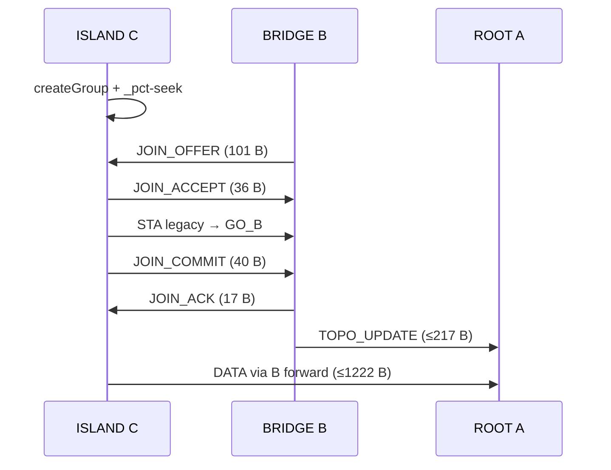

# 09 — Protocolo de unión simétrica

**Versión:** 0.1.0-pre

---

## 1. Principio de unión simétrica

La incorporación no depende solo de miembros estables anunciando presencia. Todo nodo no incorporado (`ISLAND`) anuncia `_pct-seek._tcp`. Los miembros escuchan y responden con `JOIN_OFFER`. La asociación Wi-Fi usa **STA legacy** al GO del anfitrión.

**Invariante:**

> ∀ ISLAND C, ∃ miembro M tal que en ≤ `T_JOIN_MAX_MS` (60000 ms), M envía `JOIN_OFFER` válido o C se asocia vía TXT `go_ssid`/`go_psk`.

---

## 2. Flujos de unión

### 2.1 Bootstrap — primer nodo (ROOT)

| Paso | Acción | Bytes en wire (aprox.) |
|---|---|---|
| 1 | `createGroup()` | — |
| 2 | `addLocalService(_pct-seek)` | TXT ~115 B |
| 3 | Espera `T_ROOT_ELECT_MS` | — |
| 4 | Sin `_pct-ctrl` ajeno → auto ROOT | — |
| 5 | `removeLocalService(seek)` + `addLocalService(ctrl)` | TXT ~198 B |
| 6 | Escucha TCP `:8765` | — |

---

### 2.2 Unión vía detección `_pct-seek`

| Paso | Actor | Mensaje | Frame (B) |
|---|---|---|---|
| 1 | C | GO + `_pct-seek` | — |
| 2 | B | `discoverServices` detecta C | — |
| 3 | B → C | `JOIN_OFFER` (P2P TCP*) | 101 |
| 4 | C → B | `JOIN_ACCEPT` | 36 |
| 5 | C | `requestNetwork(B.go_ssid, B.go_psk)` | — |
| 6 | C → B | `JOIN_COMMIT` (LAN TCP) | 40 |
| 7 | B → C | `JOIN_ACK` | 17 |
| 8 | B | `TOPO_UPDATE` a vecinos | ≤217 |

\*P2P TCP pre-STA: conexión TCP directa a IP P2P de B si disponible; si no, C usa TXT `go_ssid`/`go_psk` y salta a paso 5, luego `JOIN_COMMIT` por LAN.

---

### 2.3 Unión directa vía `_pct-ctrl` TXT

| Paso | Acción |
|---|---|
| 1 | C escanea / descubre `_pct-ctrl` de A |
| 2 | Lee `go_ssid`, `go_psk`, `cp` del TXT |
| 3 | `requestNetwork` → STA legacy |
| 4 | TCP `HELLO` (59 B) + `JOIN_COMMIT` (40 B) sin offer previo |
| 5 | A responde `JOIN_ACK` + asigna rol/hop |

**JOIN_COMMIT sin offer:** `offer_id=0`, `via=1` (DNS_TXT_DIRECT).

---

### 2.4 Unión tardía (A–B operativos, llega C cerca de B)

```
A (ROOT, GO) ←── STA ── B (BRIDGE, GO)     C (ISLAND, GO)
                              ▲                  │
                              └── JOIN_OFFER ────┘
                                  (detecta _pct-seek)
C → STA legacy a GO de B (SSID B, no A)
Tráfico C→A: forward en B
A y B no reinician SSID ni epoch global (solo tree_version++)
```

---

### 2.5 Relay SEEKER_FOUND (opcional)

Si C solo visible por LEAF L, L envía a padre B:

| Mensaje | Frame |
|---|---|
| `SEEKER_FOUND` L→B | 49 B |
| B inicia flujo JOIN_OFFER → C | 101 B |

---

## 3. Elección de anfitrión (`score` teórico)

```
score = (battery_pct * 10)
      + (cap & CAP_GO_STA_CONCURRENT ? 50 : 0)
      + (free_ram_mb / 100 * 20)
      - (direct_children * 15)
```

| Parámetro teórico | Valor ejemplo |
|---|---|
| `battery_pct` | 85 |
| `cap` concurrent | +50 |
| `free_ram_mb` | 2048 → +409 (cap a 100) |
| `direct_children` | 1 → -15 |

**Regla:** el nodo con mayor `score` entre vecinos detectados actúa como anfitrión preferente para `JOIN_OFFER`.

---

## 4. Asignación de rol en JOIN_OFFER

| Condición | Rol asignado |
|---|---|
| Ofertante es ROOT y C tiene `CAP_GO_STA` | `BRIDGE` si `pref=BRIDGE|ANY`, else `LEAF` |
| Ofertante es BRIDGE y `accepts=1` | `LEAF` por defecto |
| C sin `CAP_GO_STA_CONCURRENT` | Solo `LEAF` |
| Hijos directos ≥ `MAX_CHILDREN` (4) | `JOIN_REJECT reason=BRIDGE_FULL` |

---

## 5. Reconexión

```
MEMBER detecta T_PONG_TIMEOUT_MS sin PING padre:
  1. Cerrar socket upstream
  2. logical := ISLAND
  3. Mantener GO (R_ISLAND_SEEK)
  4. addLocalService(_pct-seek)
  5. discoverServices + re-JOIN
  6. session_epoch conversaciones: NO incrementar
  7. epoch red: incrementar solo si ROOT caído confirmado
```

---

## 6. Secuencia completa (diagrama)



---

## 7. Errores y reintentos

| Situación | Reintento | Backoff teórico |
|---|---|---|
| JOIN_OFFER timeout | Sí | 2000 ms |
| STA fallida | Sí | 3000 ms, máx 3 |
| JOIN_REJECT | No (ajustar rol/padre) | — |
| TCP reset | Sí | 1000 ms |

**Máximo reintentos JOIN:** `JOIN_RETRY_MAX=3`
