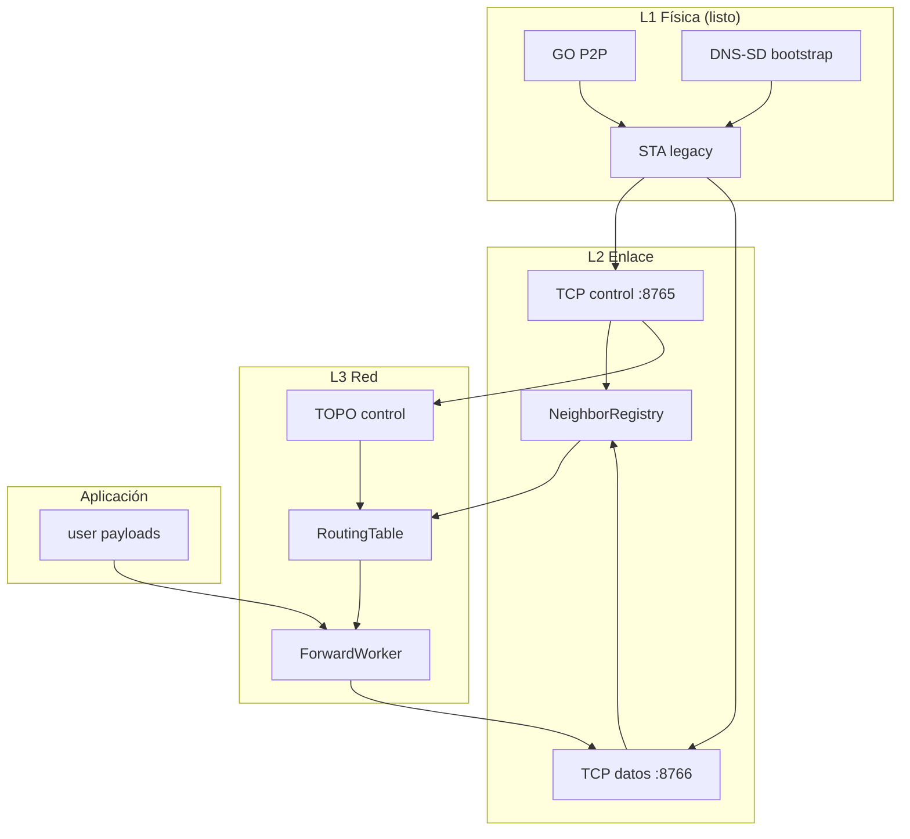

# 13 — Modelo por capas (referencia OSI)

**Versión:** 0.2.1-draft  
**Estado:** diseño previo a implementación de enlace formal y capa de red  
**Relacionado:** [03-architecture.md](03-architecture.md), [04-link-model-go-legacy.md](04-link-model-go-legacy.md), [07-routing-and-topology.md](07-routing-and-topology.md)

---

## 1. Propósito

Este documento fija **qué capa hace qué** en PCT, qué ya está demostrado en laboratorio (`lib-pct-core` / EXP-01) y qué falta implementar antes de multisalto real con reenvío.

PCT **no** implementa una pila OSI completa: usamos el modelo OSI solo como **mapa conceptual** para separar responsabilidades.

---

## 2. Mapa capa ↔ PCT

| Capa OSI (ref.) | Nombre PCT | Responsabilidad | Transporte físico | Estado actual |
|---|---|---|---|---|
| **1 — Física** | Enlace radio Wi‑Fi | GO P2P + asociación STA legacy al SoftAP del padre | 802.11 (Wi‑Fi Direct + infra) | **Operativo** en prototipo |
| **2 — Enlace** | Plano de vecindad | Identidad del vecino, **dos** TCP por vecino (control + datos), registro padre/hijos | Control `:8765`, datos `:8766` | **Parcial** |
| **3 — Red** | Plano de reenvío lógico | Tabla de rutas, reenvío multisalto `type=user` | Solo canal **datos** `:8766` | **No implementado** |
| **4 — Transporte** | (Absorbido en L3 PCT) | Confiabilidad por conexión TCP vecino-a-vecino | TCP | Diseño asumido |
| **5+ — Aplicación** | Mensajería usuario | Payload `type=user` del envoltorio | Encapsulado en L3 | Futuro |

**Regla de oro:** la capa de red **nunca** enruta por IP de destino final. La IP (`next_hop_local_ip`) es un **dato de enlace** para abrir el socket al vecino inmediato.

---

## 3. Capa física (L1) — cerrada para el grado

### 3.1 Qué incluye

- `createGroup()` → SoftAP/GO propio con SSID/PSK.
- `removeGroup()` antes de escanear DNS-SD (restricción Android).
- Asociación **STA legacy** (`WifiNetworkSpecifier`) al GO del padre elegido.
- DNS-SD `_pct-ctrl` como **bootstrap** (descubrimiento de credenciales y `node_id` remoto vía instance/TXT).

### 3.2 Qué no incluye

- `WifiP2pManager.connect()` para formar el árbol.
- NAT kernel multisalto.
- Modificación de driver/firmware.

### 3.3 Evidencia

Prototipo `co.uan.pct:core` (EXP-01 portado): cadena ROOT → BRIDGE → BRIDGE en laboratorio con STA + GO simultáneo.

**Documentación de laboratorio:** [../prototype/proto-exp01-gostat/](../prototype/proto-exp01-gostat/)

---

## 4. Capa de enlace (L2) — trabajo inmediato

### 4.1 Objetivo

Sustituir mecanismos **ad hoc** (UDP HELLO broadcast, listas derivadas de `clientList` MAC) por un **plano de control formal padre ↔ hijo**:

1. Tras STA exitoso, el **hijo inicia TCP control** al padre (`parent_ip:8765`).
2. Intercambio **HELLO** y negociación **canal datos** (`:8766`) vía control.
3. Registro en **NeighborRegistry** (`ctrl_socket` + `data_socket`).
4. Publicación de identidad UUID en UI y en estructuras internas desde **NeighborRegistry**, no desde MAC.

### 4.2 Alcance L2

| Incluido | Excluido |
|---|---|
| HELLO, JOIN_COMMIT, PING/PONG | Reenvío multisalto |
| TOPO_UPDATE entre **vecinos directos** | Flooding global sin TTL |
| Mapa `{ neighbor_nid → ctrl/data socket, local_ip, iface }` | Routing a destinos no vecinos |

Ver [14-link-layer.md](14-link-layer.md).

---

## 5. Capa de red (L3) — siguiente hito

### 5.1 Objetivo

Permitir que un paquete con `destination = UUID` atraviese **N saltos** en un dispositivo **sin NAT**, usando una **tabla de reenvío relativa** en cada nodo.

### 5.2 Entrada de tabla (vista operador)

| Campo | Significado |
|---|---|
| `destination_uuid` | Nodo destino lógico |
| `next_hop_uuid` | Primer vecino TCP al que reenviar |
| `next_hop_local_ip` | IP en **mi** subred para llegar a ese vecino |
| `hop_count` | Distancia lógica conocida hasta el destino |

Ver [15-network-layer.md](15-network-layer.md) para reglas de aprendizaje, fusión distribuida y workers.

---

## 6. Envoltorio y canales (L2/L3)

Mismo sobre lógico `{ type, destination, content }`, pero **canal TCP distinto** según `type`:

| `type` | Puerto | Uso |
|---|---|---|
| `control` | 8765 | HELLO, TOPO, PING, apertura/recuperación canal datos |
| `user` | 8766 | DATA multisalto (ForwardWorker) |

Ver [16-packet-envelope.md](16-packet-envelope.md).

---

## 7. Diagrama de dependencias

---

## 8. Brecha prototipo ↔ spec

| Aspecto | Prototipo `lib-pct-core` hoy | Target spec |
|---|---|---|
| Identidad hijo en padre | UDP HELLO + fallback MAC `clientList` | TCP HELLO → NeighborRegistry |
| Comunicación control | Broadcast UDP `:8765` | TCP `:8765` dedicado |
| Comunicación user | — | TCP `:8766` dedicado |
| Tabla de rutas | Solo `TopologySnapshot` UI | `RoutingTable` + Forwarder |
| Multisalto | No | Reenvío por `destination_uuid` |
| UI hijos | Puede mostrar MAC si HELLO no llega | Siempre UUID desde L2 |

Ver [17-implementation-roadmap.md](17-implementation-roadmap.md).

---

## 9. Decisiones normativas (v0.2)

1. **DNS-SD** permanece en L1/bootstrap; no es canal de datos multisalto.
2. **UDP broadcast** queda **deprecado** para registro de hijos; solo tolerado en transición de laboratorio.
3. **Toda** identidad mostrada al operador y usada en L3 proviene de **`node_id` UUID** (32 hex sin guiones en UI).
4. Workers de red consumen la misma tabla; no hay rutas “especiales” fuera del Forwarder.
