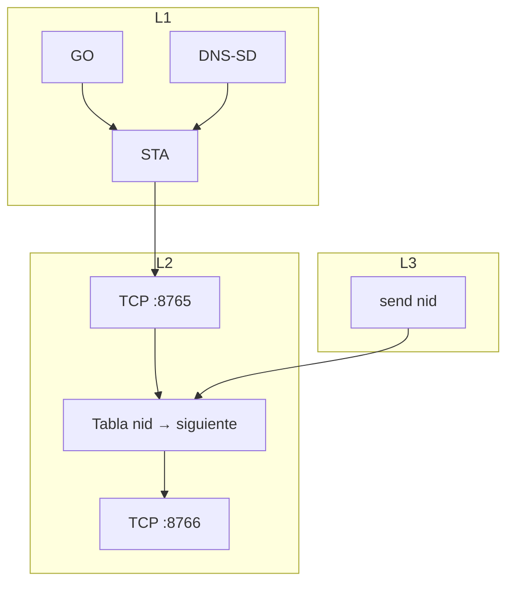

# 13 — Modelo por capas (referencia OSI)

**Versión:** 0.2.1-draft  
**Estado:** diseño previo a implementación de enlace formal y capa de red  
**Relacionado:** [03-architecture.md](03-architecture.md), [04-link-model-go-legacy.md](04-link-model-go-legacy.md), [07-routing-and-topology.md](07-routing-and-topology.md)

---

## 1. Propósito

Este documento fija **qué capa hace qué** en PCT, qué ya está demostrado en laboratorio (`lib-pct-core` / EXP-01) y qué falta implementar antes de multisalto real con reenvío.

PCT **no** implementa una pila OSI completa: usamos el modelo OSI solo como **mapa conceptual** para separar responsabilidades.

---

## 2. Mapa capa ↔ PCT

| Capa OSI (ref.) | Nombre PCT | Responsabilidad | Transporte físico | Estado actual |
|---|---|---|---|---|
| **1 — Física** | Radio Wi‑Fi | GO + STA legacy + DNS-SD bootstrap | 802.11 | **En curso** (`PhysicalLayer`) |
| **2 — Enlace** | TCP + tabla | `:8765` negociar arista y rutas; IP solo aquí; luego `:8766` usuario | TCP vecino | **En curso** (`LinkLayer`) |
| **3 — Red** | Reenvío usuario | `MeshSocket.send(nid)` usa la tabla de L2; no ve IPs | Solo `:8766` | **En curso** |
| **5+ — Aplicación** | Chat / payload | Bytes hacia un `node_id` | Encapsulado | Futuro |

**Regla de oro:** arriba de L2 solo hay `node_id`. Las IP de SoftAP/STA no salen de L2.

---

## 3. Capa física (L1) — cerrada para el grado

### 3.1 Qué incluye

- `createGroup()` → SoftAP/GO propio con SSID/PSK.
- Asociación **STA legacy** al GO del padre (sin apagar el GO para escanear: cola P2P).
- DNS-SD `_pct-ctrl` como bootstrap (credenciales / `node_id`).

### 3.2 Qué no incluye

- `WifiP2pManager.connect()` para formar el árbol.
- NAT kernel multisalto.
- Modificación de driver/firmware.

### 3.3 Evidencia

Prototipo `co.uan.pct:core` (EXP-01 portado): cadena ROOT → BRIDGE → BRIDGE en laboratorio con STA + GO simultáneo.

**Documentación de laboratorio:** [../prototype/proto-exp01-gostat/](../prototype/proto-exp01-gostat/)

---

## 4. Capa 2 — siguiente trabajo

Tras STA: TCP `:8765`, acordar padre/hijo, mantener la **tabla de rutas** (nids hacia arriba; IP solo dentro de L2). Después, `:8766` para usuario.

Ver [14-link-layer.md](14-link-layer.md).

---

## 5. Capa 3 — reenvío

`send(destino_nid, bytes)`. No guarda IPs. L2 elige el vecino y escribe en `:8766`.

Ver [15-network-layer.md](15-network-layer.md).

---

## 6. Dos puertos

| Puerto | Qué |
|---|---|
| `:8765` | Identidad, sentido de arista, keep-alive, actualizaciones de tabla |
| `:8766` | Payload de usuario (cuando L2 ya tiene al vecino en la tabla) |

---

## 7. Dependencias

---

## 8. Decisiones

1. DNS-SD es solo L1.
2. Tabla de rutas en L2; L3 solo nids.
3. Identidad = `node_id` en el TCP, nunca MAC.
4. Un padre, N hijos.
