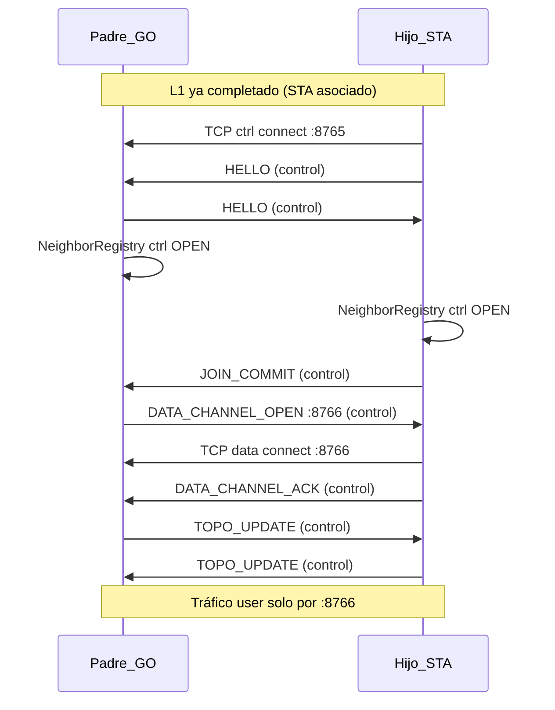

# 14 — Capa de enlace (L2): vecindad padre–hijo

**Versión:** 0.2.1-draft  
**Prerequisito:** [04-link-model-go-legacy.md](04-link-model-go-legacy.md), [06-tcp-messages.md](06-tcp-messages.md)

---

## 1. Alcance

La capa de enlace PCT define:

- Cómo dos nodos **directamente conectados** (padre GO ↔ hijo STA) establecen un **canal de control confiable**.
- Cómo cada nodo mantiene un **registro de vecinos** con UUID, IP local y socket.
- Qué mensajes son **solo L2** (no reenviables más allá del vecino).

**Fuera de alcance L2:** reenvío a destinos no adyacentes (L3), DNS-SD bootstrap (L1).

---

## 2. Principios

| # | Regla |
|---|---|
| E1 | Solo existen enlaces **upstream** (1) y **downstream** (N). |
| E2 | El **hijo** inicia TCP hacia el padre tras `StaState.Connected`. |
| E3 | Identidad autoritativa = `sender_nid` en HELLO; nunca MAC SoftAP. |
| E4 | Prohibido depender de UDP broadcast para registro crítico. |
| E5 | Cada par padre–hijo mantiene **dos** sockets TCP independientes (§2.1). |
| E6 | Tráfico **control** y **usuario** nunca comparten el mismo socket. |
| E7 | La caída del canal usuario **no** implica reiniciar el nodo; el canal control reabre datos. |

### 2.1 Dos canales TCP por vecino (normativo)

Android no garantiza fairness ni backpressure predecible en un único `Socket`. Mezclar PING/TOPO periódicos con ráfagas `type=user` satura el enlace y puede bloquear el control.

| Canal | Puerto default | Tráfico | Prioridad |
|---|---|---|---|
| **Control** | `8765` (`PCT_CTRL_PORT`) | HELLO, JOIN_*, PING/PONG, TOPO_UPDATE, NODE_DOWN, señalización canal datos | Alta — siempre activo |
| **Datos (usuario)** | `8766` (`PCT_DATA_PORT`) | Solo frames `type=user` (DATA multisalto) | Normal — aislable |

Constantes: [12-theoretical-constants.md](12-theoretical-constants.md) §1.

**Invariante:** un `NeighborRecord` tiene `ctrl_socket` **y** `data_socket` (este último puede estar `CLOSED` mientras control sigue `OPEN`).

---

## 3. NeighborRegistry

Estructura local en cada nodo (no se serializa tal cual; se deriva de HELLO/JOIN).

### 3.1 Entrada `NeighborRecord`

| Campo | Tipo | Descripción |
|---|---|---|
| `neighbor_nid` | UUID (16 B) | Identidad del vecino |
| `iface` | enum | `UPSTREAM` \| `DOWNSTREAM` |
| `local_ip` | IPv4 | IP del vecino **vista desde este nodo** |
| `ctrl_port` | uint16 | Default `8765` |
| `data_port` | uint16 | Default `8766` |
| `ctrl_socket` | opaco | TCP control (persistente) |
| `data_socket` | opaco | TCP datos usuario (puede ser null) |
| `data_channel_state` | enum | `CLOSED` \| `OPEN` \| `RECONNECTING` |
| `role` | enum | Rol remoto (ROOT/BRIDGE/LEAF) |
| `hop` | uint8 | Hop lógico anunciado por el vecino |
| `last_ctrl_ms` | uint64 | Último PING/PONG/HELLO |
| `last_data_ms` | uint64 | Último frame usuario (si aplica) |

### 3.2 Invariantes

- `UPSTREAM`: 0 o 1 registro (padre).
- `DOWNSTREAM`: 0..N (hijos directos).
- `local_ip` upstream en hijo: gateway típico del SoftAP padre (p. ej. `192.168.49.1`).
- `local_ip` downstream en padre: IP DHCP asignada al hijo en **mi** GO (p. ej. `192.168.49.2`).

**Nota Android:** la IP del hijo puede obtenerse tras HELLO + reverse connect o campo extendido en JOIN_COMMIT (ver §5).

---

## 4. Secuencia de establecimiento L2



### 4.1 Orden obligatorio

1. L1: STA connected.
2. L2: **Canal control** TCP `:8765` + HELLO bidireccional.
3. L2: JOIN_COMMIT (control).
4. L2: Negociación **canal datos** `:8766` vía mensajes control (§5.2).
5. L2→L3: TOPO_UPDATE inicial (solo canal control).

---

## 5. Mensajes L2 (catálogo)

### 5.1 Solo canal control (`:8765`)

| msg_type | Nombre | Dirección | Propósito |
|---|---|---|---|
| 0x01 | HELLO | ↔ | Identidad, rol, hop, capabilities |
| 0x05 | JOIN_COMMIT | Hijo → Padre | Confirmación post-STA |
| 0x07 | PING | ↔ | Keepalive control |
| 0x08 | PONG | ↔ | Respuesta keepalive |
| 0x06 | TOPO_UPDATE | ↔ vecino | Sincronización rutas L3 |
| 0x09 | NODE_DOWN | ↔ vecino | Vecino caído |
| 0x0D | DATA_CHANNEL_OPEN | Padre → Hijo | Invitar connect `:8766` |
| 0x0E | DATA_CHANNEL_ACK | Hijo → Padre | Canal datos listo |
| 0x0F | DATA_CHANNEL_RESET | ↔ | Forzar reopen canal datos |

Wire format binario base: [06-tcp-messages.md](06-tcp-messages.md). Tipos `0x0D..0x0F` definidos en Incremento 2.

### 5.2 Negociación canal datos

1. Tras JOIN_COMMIT, el **padre** envía `DATA_CHANNEL_OPEN` (puerto, epoch opcional) por **control**.
2. El **hijo** abre TCP `:8766` hacia `parent_ip`.
3. El hijo confirma con `DATA_CHANNEL_ACK` por **control**.
4. Ambos marcan `data_channel_state = OPEN`.

Si el socket datos falla (timeout, `IOException`, cola llena):

1. Marcar `data_channel_state = RECONNECTING`; **mantener control OPEN**.
2. Emisor de recuperación envía `DATA_CHANNEL_RESET` por control.
3. Repetir pasos 1–3 **sin** tocar GO/STA/DNS-SD.

**Prohibido** enviar `TOPO_UPDATE`, `PING` o `HELLO` por el socket `:8766`.

### 5.3 Solo canal datos (`:8766`)

| msg_type | Nombre | Propósito |
|---|---|---|
| 0x0A | DATA | Envelope `type=user` (local o reenviado L3) |

El ForwardWorker **solo** escribe/lee DATA en `data_socket`.

### 5.4 HELLO y UUID en UI

Tras HELLO válido:

- Padre: `TopologySnapshot.children[].nodeId = sender_nid`.
- Hijo: `TopologySnapshot.parent.nodeId = sender_nid` del padre.

**Prohibido** mostrar MAC de `WifiP2pGroup.clientList` como identidad primaria en UI cuando L2 está activo.

---

## 6. Servidores TCP en cada nodo

Todo nodo GO escucha **dos** puertos en la interfaz del SoftAP:

| ServerSocket | Puerto | Worker |
|---|---|---|
| `ControlAcceptWorker` | `8765` | Sesión control; HELLO; nunca DATA usuario |
| `DataAcceptWorker` | `8766` | Solo frames DATA (`type=user`) |

```
ControlAcceptWorker:
  loop accept(:8765)
    spawn ControlPeerSession(ip)
    esperar HELLO → NeighborRegistry (ctrl)

DataAcceptWorker:
  loop accept(:8766)
    spawn DataPeerSession(ip)
    asociar a NeighborRecord existente (ctrl ya registró UUID)
    marcar data_channel_state = OPEN
```

El hijo, tras STA:

1. Connect activo `:8765` (control).
2. Tras `DATA_CHANNEL_OPEN`, connect activo `:8766` (datos).

**Android:** dos `ServerSocket`, dos bucles de lectura independientes (corrutinas/hilos separados). Cola de envío control acotada (p. ej. 32 frames); cola datos con límite mayor pero **descartable** bajo presión (no afecta control).

---

## 7. Deprecación: UDP HELLO (prototipo 1.1.5)

El prototipo actual envía `PCT1|HELLO|nid|role|hop` por UDP broadcast. Problemas:

| Problema | Impacto |
|---|---|
| Broadcast no confiable | Padre no siempre recibe |
| Sin ACK | UI queda en MAC |
| Mezcla L1/L2 | Confunde capas |
| Sin socket persistente | No hay base para L3 |

**Plan:** mantener UDP solo como fallback de laboratorio hasta que TCP L2 esté verificado; luego eliminar.

---

## 8. LinkWorker (concepto de implementación)

| Worker | Socket | Responsabilidad |
|---|---|---|
| `ControlAcceptWorker` | `:8765` | Accept + HELLO/JOIN |
| `DataAcceptWorker` | `:8766` | Accept DATA |
| `ControlConnectWorker` | `:8765` | Connect upstream tras STA |
| `DataConnectWorker` | `:8766` | Connect tras DATA_CHANNEL_OPEN |
| `ControlKeepaliveWorker` | `:8765` | PING/PONG; detecta muerte control |
| `DataChannelRecoveryWorker` | control → reopen data | DATA_CHANNEL_RESET |
| `NeighborRegistry` | — | Fuente única de verdad L2 |

**Regla de concurrencia:** mutación de `NeighborRegistry` en un solo actor. Lectura de `data_socket` nunca bloquea el loop de control.

---

## 9. Criterios de aceptación L2

- [ ] Tras join, padre lista hijos con **UUID idéntico** al `node_id` del hijo.
- [ ] Hijo lista padre con UUID del registro DNS-SD/TCP.
- [ ] No se requiere UDP broadcast para el caso feliz.
- [ ] Desconexión STA → NODE_DOWN + limpieza NeighborRegistry downstream/upstream.
- [ ] Ráfaga de mensajes usuario **no** retrasa PING/TOPO en canal control.
- [ ] Caída socket `:8766` se recupera vía control **sin** reiniciar bootstrap L1.
