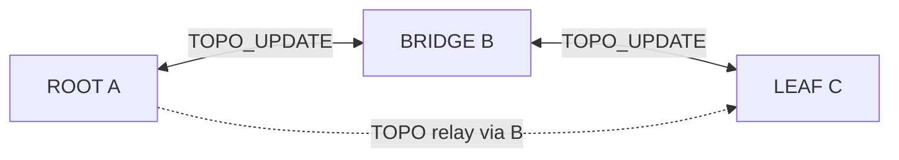

# 15 — Capa de red (L3): tabla de saltos y reenvío

**Versión:** 0.2.1-draft  
**Prerequisito:** [07-routing-and-topology.md](07-routing-and-topology.md), [14-link-layer.md](14-link-layer.md)

---

## 1. Problema

En Android, un nodo multisalto tiene:

- **Un** STA upstream (padre).
- **Un** GO downstream (hijos).
- **Sin NAT** usable para enrutar IP de otra subred.

Por tanto, el destino de una conversación debe ser **`destination_uuid`**, no una IP global. Cada nodo mantiene una **tabla relativa** que responde: “¿por qué vecino TCP reenvío hacia ese UUID?”.

---

## 2. RoutingEntry (vista operador)

Tabla acordada para diseño (compatible con [07-routing-and-topology.md](07-routing-and-topology.md)):

| Campo | Tipo | Descripción |
|---|---|---|
| `destination_uuid` | UUID | Destino lógico final |
| `next_hop_uuid` | UUID | Vecino directo al que reenviar |
| `next_hop_local_ip` | IPv4 | IP para socket hacia ese vecino **en mi LAN** |
| `hop_count` | uint8 | Saltos hasta destino |

### 2.1 Campos internos adicionales (implementación)

| Campo | Uso |
|---|---|
| `path_seq` | Desempate en fusiones |
| `status` | ACTIVE / BACKUP / STALE / BROKEN |
| `last_seen_ms` | Expiración |
| `origin_nid` | Quién anunció la ruta (anti-loop) |

---

## 3. Ejemplo: cadena A → B → C

UUIDs:

| Nodo | UUID (abreviado) | Rol |
|---|---|---|
| A | `0000…` | ROOT |
| B | `1111…` | BRIDGE |
| C | `2222…` | BRIDGE/LEAF |

### 3.1 Tabla en A (ROOT)

| destination_uuid | next_hop_uuid | next_hop_local_ip | hop_count |
|---|---|---|---|
| `1111…` | `1111…` | `192.168.49.2` (IP de B en GO-A) | 1 |
| `2222…` | `1111…` | `192.168.49.2` | 2 |

Interpretación: para llegar a C, A reenvía a B (vecino directo). B conoce el camino restante.

### 3.2 Tabla en B (BRIDGE)

| destination_uuid | next_hop_uuid | next_hop_local_ip | hop_count |
|---|---|---|---|
| `0000…` | `0000…` | `192.168.49.1` (gateway GO-A, upstream) | 1 |
| `1111…` | `1111…` | *self* | 0 |
| `2222…` | `2222…` | `192.168.49.2` (IP de C en GO-B) | 1 |

`*` Entrada local: entregar a stack local.

### 3.3 Tabla en C

| destination_uuid | next_hop_uuid | next_hop_local_ip | hop_count |
|---|---|---|---|
| `0000…` | `1111…` | `192.168.49.1` (gateway GO-B) | 2 |
| `1111…` | `1111…` | `192.168.49.1` | 1 |
| `2222…` | `2222…` | *self* | 0 |

**Nota:** `next_hop_uuid = destination_uuid` cuando el destino es **vecino directo** (1 hop). Cuando el destino eres tú mismo, no hay reenvío.

### 3.4 Convención `*` del usuario

En la tabla del operador, `*` en `next_hop_uuid` puede significar:

- **Entrega local** (`destination == self`).
- **Vecino directo** (`next_hop == destination`).

En implementación se distinguen con `hop_count == 0` (self) vs `hop_count == 1` (vecino).

---

## 4. ¿Cómo se aprende `hop_count`?

| Fuente | Mecanismo |
|---|---|
| HELLO | El vecino anuncia su `hop` lógico |
| JOIN_COMMIT | Padre asigna `hop_child = hop_parent + 1` |
| TOPO_UPDATE | Entrada `(dest, hop, path_seq)` propagada con TTL |
| Inferencia local | Ruta a vecino directo: `hop_count = 1` |

### 4.1 Regla de fusión (resumen)

Al recibir TOPO_UPDATE para `(dest, hop_d, seq)`:

1. Si no existe entrada → insertar.
2. Si `hop_d` < `hop_known` → reemplazar.
3. Si empate en hop → mayor `path_seq` gana.
4. Si `origin == self` → descartar (anti-loop).
5. Decrementar TTL; reenviar a vecinos excepto originador.

Detalle: [07-routing-and-topology.md](07-routing-and-topology.md) §3.

---

## 5. Sincronización distribuida

Objetivo: **cada nodo tiene una copia coherente de rutas hacia todos los UUID conocidos**, relativa a su posición.



### 5.1 Eventos que disparan TOPO_UPDATE

| Evento | Acción |
|---|---|
| JOIN_COMMIT nuevo hijo | Padre anuncia ruta al hijo + relay |
| HELLO con hop cambiado | Actualizar rutas directas |
| NODE_DOWN | Purga rutas vía `failed_nid` |
| PING timeout vecino | Marcar STALE → BROKEN |

### 5.2 Workers (modelo propuesto)

| Worker | Canal TCP | Función |
|---|---|---|
| `RouteSyncWorker` | **Control** `:8765` | Recibe/emite TOPO_UPDATE |
| `RouteAdvertiseWorker` | **Control** | Emite TOPO_UPDATE tras cambios |
| `ForwardWorker` | **Datos** `:8766` | Procesa envelope user; entrega o reenvía |
| `StaleRouteWorker` | Control (timer) | Expiración rutas |
| `DataChannelRecoveryWorker` | Control señaliza / Data reconnect | Reabre `:8766` sin tocar L1 |

Todos leen/escriben `RoutingTable` bajo el mismo actor que `NeighborRegistry`. **ForwardWorker nunca usa `ctrl_socket`.**

---

## 6. Algoritmo ForwardWorker

**Precondición:** `neighbor.data_channel_state == OPEN` hacia el `next_hop`. Si está `CLOSED`/`RECONNECTING`, no reenviar; opcionalmente solicitar `DATA_CHANNEL_RESET` por control y encolar (o descartar con log).

Pseudocódigo:

```
FUNCIÓN handle_user(envelope):  // solo type=user, solo socket :8766
  SI envelope.destination == self.node_id:
    deliver_to_app(envelope.content)
    RETORNAR

  entry ← routing_table[envelope.destination]
  SI entry == NULL O entry.status != ACTIVE: DESCARTAR

  SI hop_limit == 0 O self in path_trace: DESCARTAR

  neighbor ← neighbor_registry[entry.next_hop_uuid]
  SI neighbor.data_socket == NULL O neighbor.data_channel_state != OPEN:
    trigger_data_channel_recovery(neighbor)  // vía control, no reinicia nodo
    RETORNAR

  envelope.hop_limit -= 1
  envelope.path_trace.append(self.node_id)
  ENVIAR envelope por neighbor.data_socket   // nunca ctrl_socket
```

**Control L3** (`TOPO_UPDATE`, `NODE_DOWN`) usa **solo** `ctrl_socket` — ver [14-link-layer.md](14-link-layer.md) §5.1.

**Importante:** el ForwardWorker **no** re-empaqueta en otro formato; solo muta metadatos de tránsito (`hop_limit`, `path_trace`).

---

## 7. Relación L2 ↔ L3

| Pregunta | Capa que responde |
|---|---|
| ¿Quién es mi padre/hijo? | L2 `NeighborRegistry` |
| ¿Qué IP uso para hablar con el vecino X? | L2 `NeighborRecord.local_ip` |
| ¿Cómo llego al UUID Z lejano? | L3 `RoutingTable` → `next_hop_uuid` |
| ¿Por qué socket envío control? | L2 `NeighborRecord.ctrl_socket` |
| ¿Por qué socket envío user/multisalto? | L2 `NeighborRecord.data_socket` |

La columna `next_hop_local_ip` en la tabla L3 es **redundante** con NeighborRegistry si `next_hop_uuid` siempre es vecino directo — se mantiene en la spec por **claridad operador** y debug; en código puede derivarse.

---

## 8. Límites teóricos

| Constante | Valor | Ref |
|---|---|---|
| `HOP_LIMIT_MAX` | 7 | [12-theoretical-constants.md](12-theoretical-constants.md) |
| `ROUTE_TABLE_MAX` | 32 entradas | idem |
| `TOPO_TTL_DEFAULT` | 7 | idem |

---

## 9. Criterios de aceptación L3

- [ ] A envía payload `type=user` a C; C recibe mismo `content`.
- [ ] B reenvía sin interpretar `content` (transparente).
- [ ] Tras caída de B, rutas STALE y reconvergencia tras re-JOIN.
- [ ] Tablas en A/B/C listan las mismas UUID conocidas con `hop_count` coherente.
- [ ] Saturación del canal `:8766` no impide TOPO/PING en `:8765`.
- [ ] Tras matar solo el socket datos A↔B, control reestablece `:8766` sin reboot del nodo.
