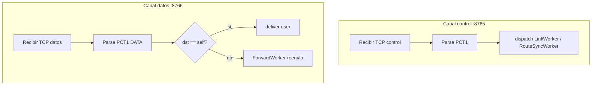

# 16 — Envoltorio de paquetes (control vs usuario)

**Versión:** 0.2.1-draft  
**Prerequisito:** [06-tcp-messages.md](06-tcp-messages.md), [14-link-layer.md](14-link-layer.md), [15-network-layer.md](15-network-layer.md)

---

## 1. Propósito

Definir el **sobre lógico** para tráfico multisalto y **en qué canal TCP** viaja cada tipo:

| `type` | Canal TCP | Puerto |
|---|---|---|
| `control` | Control | `8765` |
| `user` | Datos | `8766` |

**No compartir socket:** mezclar control periódico y ráfagas usuario en un solo TCP satura el enlace en Android y puede bloquear PING/TOPO; el canal control debe poder **reabrir** el de datos sin reiniciar el nodo ([14-link-layer.md](14-link-layer.md) §2.1).

---

## 2. Modelo lógico (JSON — diseño)

Vista humana y contrato entre capas internas:

```json
{
  "type": "control",
  "destination": "22222222222222222222222222222222",
  "content": "<string o objeto serializado>"
}
```

| Campo | Valores | Descripción |
|---|---|---|
| `type` | `control` \| `user` | Plano del payload **y** selector de canal |
| `destination` | UUID 32 hex | Destino lógico final |
| `content` | string / blob | Cuerpo opaco para el receptor final |

### 2.1 Regla de canal (normativa)

| `type` | Socket permitido | Prohibido |
|---|---|---|
| `control` | `ctrl_socket` `:8765` | Enviar por `:8766` |
| `user` | `data_socket` `:8766` | Enviar por `:8765` |

Violación → descartar frame + log; en lab, contador debug `channel_mismatch`.

### 2.2 Extensiones de tránsito (L3, solo `type=user`)

| Campo | Tipo | Descripción |
|---|---|---|
| `hop_limit` | uint8 | TTL lógico (default 7) |
| `path_trace` | UUID[] | Nodos ya visitados (anti-ciclo) |
| `source` | UUID | Origen lógico |

---

## 3. Mapeo a wire format binario

Framing `PCT1` ([06-tcp-messages.md](06-tcp-messages.md)) en **ambos** canales; el **puerto** disambigua el subconjunto permitido.

### 3.1 Canal control (`:8765`) — `type=control`

| `msg_type` | Nombre |
|---|---|
| 0x01 | HELLO |
| 0x05 | JOIN_COMMIT |
| 0x06 | TOPO_UPDATE |
| 0x07 / 0x08 | PING / PONG |
| 0x09 | NODE_DOWN |
| 0x0D | DATA_CHANNEL_OPEN |
| 0x0E | DATA_CHANNEL_ACK |
| 0x0F | DATA_CHANNEL_RESET |

### 3.2 Canal datos (`:8766`) — `type=user`

| `msg_type` | Nombre |
|---|---|
| 0x0A | DATA |

Payload DATA (§3.3) es el envelope user completo.

### 3.3 DATA (0x0A) — payload usuario

| Offset | Tamaño | Campo |
|---|---|---|
| 0 | 16 | `src_nid` |
| 16 | 16 | `dst_nid` |
| 32 | 1 | `hop_limit` |
| 33 | 1 | `path_len` |
| 34 | 16×path_len | `path_trace[]` |
| … | variable | `content_bytes` |

---

## 4. Pipelines de recepción (separados)



**Sin multiplexación:** no hay demux `type` en un único stream; el puerto ya separó control vs user.

### 4.1 Reglas de validación

1. `destination` UUID válido (32 hex).
2. Frame DATA en `:8765` o HELLO en `:8766` → **descartar** (channel mismatch).
3. Reenvío user solo si `data_channel_state == OPEN` hacia next-hop.
4. `type=control` nunca llega a la app de chat.

---

## 5. Recuperación canal datos

Cuando `:8766` falla pero `:8765` sigue vivo:

1. `DataChannelRecoveryWorker` marca `RECONNECTING`.
2. Emisor envía `DATA_CHANNEL_RESET` por control.
3. Secuencia [14-link-layer.md](14-link-layer.md) §5.2 (OPEN → connect → ACK).
4. Reanudar cola user opcional (fuera alcance v0.2; puede descartarse en lab).

**No** se llama `close()` del nodo ni `removeGroup()` por un fallo solo de datos.

---

## 6. Ejemplo multisalto (user)

A → B → C, todos con **dos** sockets por enlace.

1. A crea envelope user; lookup ruta a C → next_hop B.
2. A envía DATA por **`data_socket(A↔B)`** `:8766`.
3. B ForwardWorker recibe en loop datos; reenvía por **`data_socket(B↔C)`**.
4. C entrega a aplicación.

TOPO/PING entre A↔B circulan en paralelo por **`ctrl_socket`**, sin competir con el DATA.

---

## 7. Criterios de aceptación

- [ ] Control y user en puertos distintos; mismatch detectado.
- [ ] `ForwardWorker` solo en `:8766`.
- [ ] Recuperación datos vía control sin reinicio L1.
- [ ] Tests: entrega local, 2 hops, saturación user + control estable.
